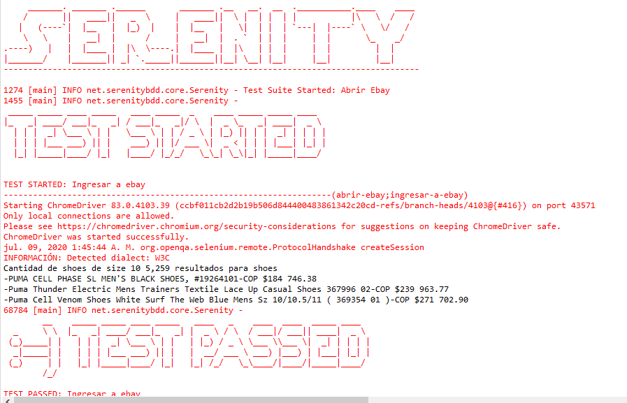

# AutomatizacionWeb con Selenium

**Patron de diseño:**  Page Object Model patrón de diseño de Object Repository en Selenium WebDriver

**Serenity - Cucumber BDD:** automatizar pruebas en BDD. 

**Ejecución:**

git clone https://@github.com/BCSL11/AutomatizacionWeb.git

git cd com.automatizacionWeb

mvn package

ejecutar test llamado RunnerTags

A continuación se muestra un Screenshot del resultado de la ejecucion.

